### ## Task Tracker

Task Assignment & Score Tracker

### Installation

You can install this app using the [bench](https://github.com/frappe/bench) CLI:

```bash
cd $PATH_TO_YOUR_BENCH
bench get-app https://github.com/abhishek-patel-dev/task-tracker.git
bench --site [your-site-name] install-app task-tracker
bench --site [your-site-name] migrate
bench restart
```


## # Python Dependencies Setup

bench setup requirements

```shell
cd $PATH_TO_YOUR_BENCH
bench setup requirements or pip install -r requirements.txt
```


### # License

mit

# # Project 1--> Task Assignment & Score Tracker

A custom Frappe application developed as part of the Technical Assessment.

## Features

- Task Assignment Management
- Due Date Extension Tracking
- Automatic Score Calculation
- Automatic Failed Status after 4 Extensions
- Person-wise Average Score Report
- Task Status Summary Report
- Overdue Task Report
- Dashboard
- Email Notification (Bonus)

---

## Requirements

- Frappe Framework v15
- ERPNext v15

---

## Workflow

### Step 1

Create a new Task Assignment.

Fill:

* Task Name
* Assigned To
* Start Date
* Original Due Date

Save.

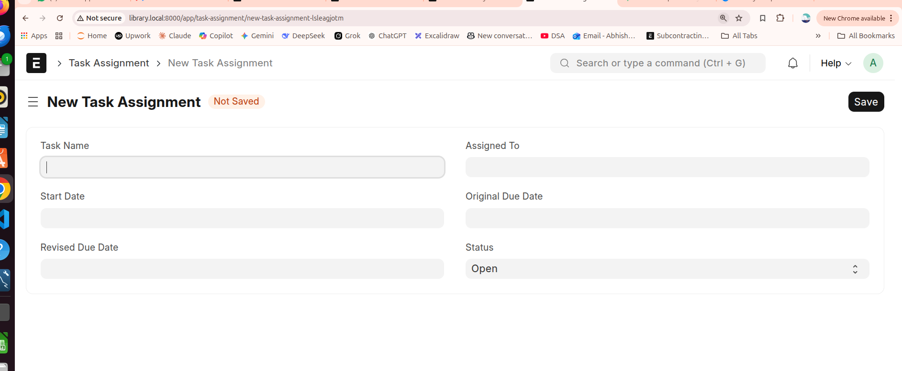

### Step 2

Whenever the Revised Due Date is extended,

Extension Count increases automatically.

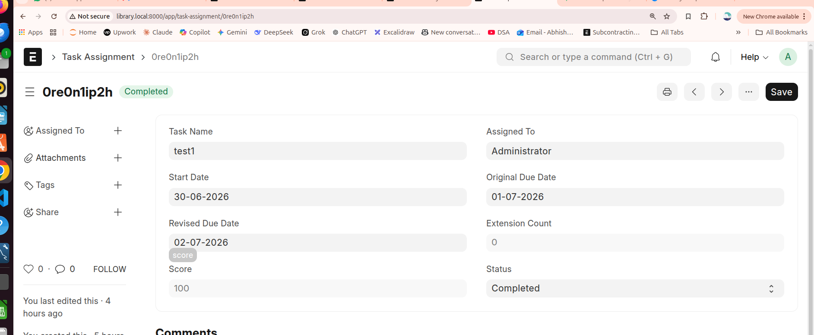

---

### Step 3

Score updates automatically.

| Extension | Score |
| --------- | ----- |
| 0         | 100   |
| 1         | 75    |
| 2         | 50    |
| 3         | 25    |
| 4         | 0     |

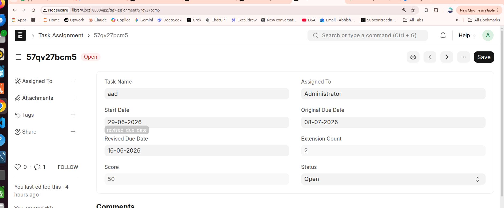

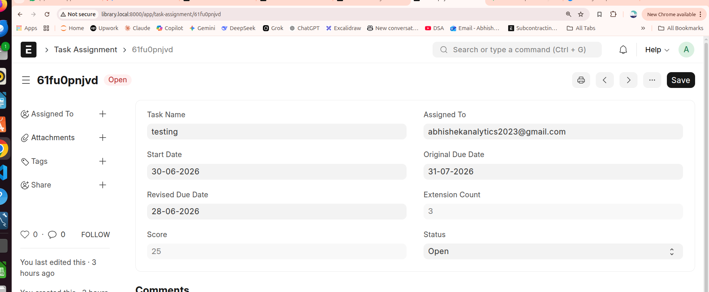

### Step 4

After 4 extensions,

Status becomes **Failed** automatically.

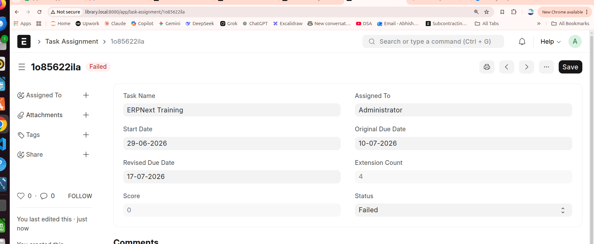

## # Reports

### 1- Task Performance Summary

Shows:

* Person-wise Average Score
* Total Tasks

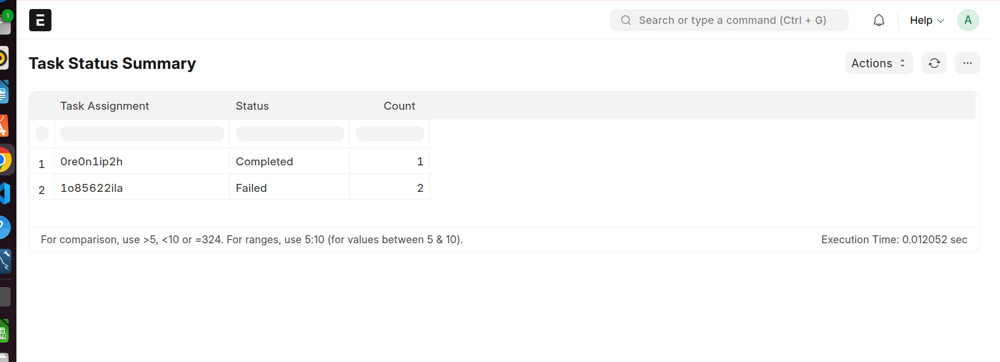

### 2- Task Status Summary

Shows

* Open
* Completed
* Failed

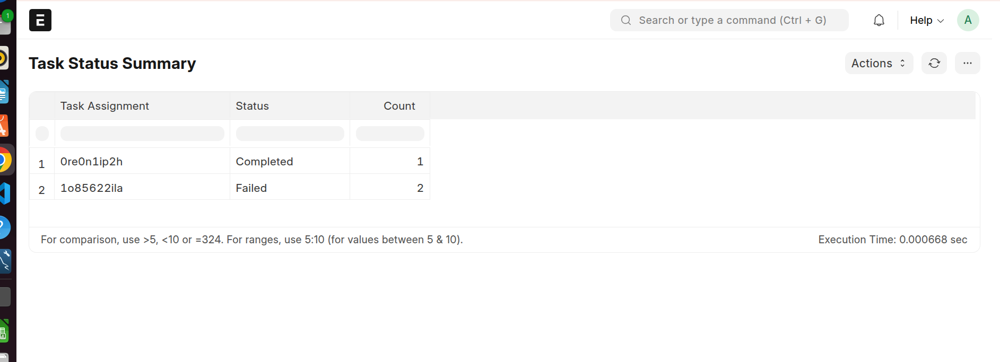

### 3- Overdue Tasks

Displays all overdue tasks excluding completed tasks.

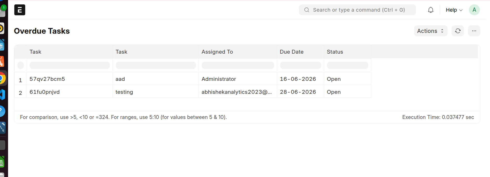

## #  Dashboard

Dashboard includes

* Person-wise Average Score
* Completed vs Failed
* Overdue Tasks

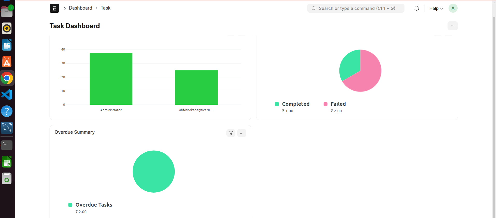

## Project 2: MIS Sales Dashboard from Raw Data

link : [docs.google.com/spreadsheets/d/1eHtpu1tPmXPKBzi1wAREm0cr-ARi0Idz/edit?usp=sharing&amp;ouid=101542049207249860365&amp;rtpof=true&amp;sd=true](https://docs.google.com/spreadsheets/d/1eHtpu1tPmXPKBzi1wAREm0cr-ARi0Idz/edit?usp=sharing&ouid=101542049207249860365&rtpof=true&sd=true)

1- month to month trend

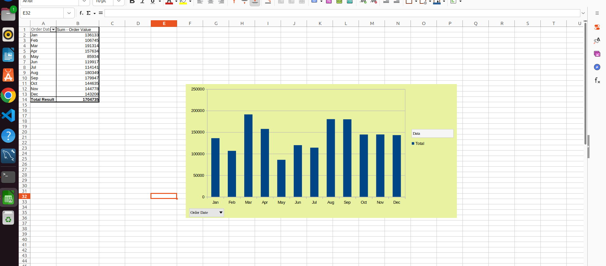

2- Top 5 project

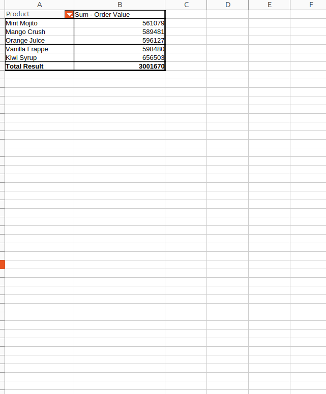

3- Regon wise performance

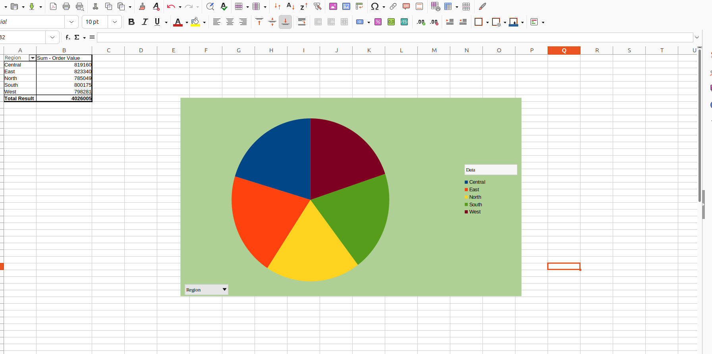

4- salesperson wise performance

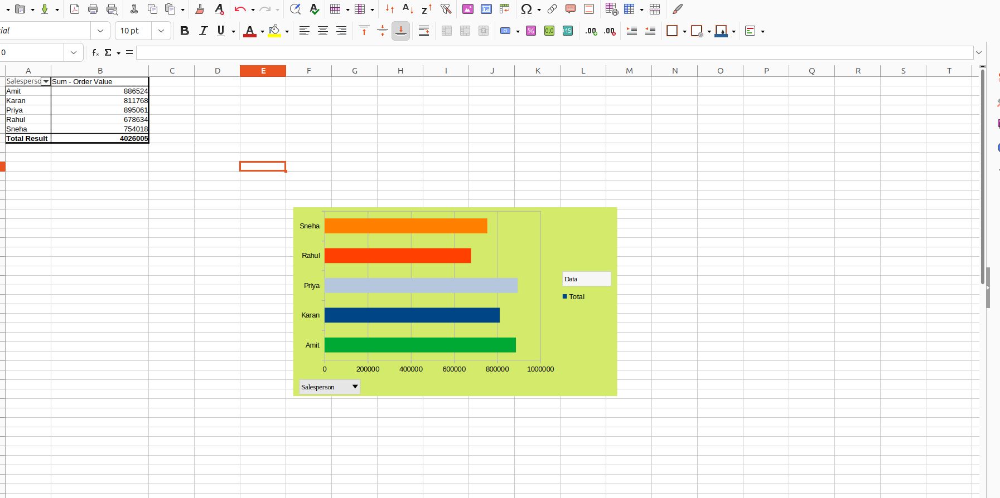

## Project 3--> AI-Powered Email Automation System

This section of the project automates customer relationship management by using Artificial Intelligence to reactivate high-value enterprise clients who haven't placed an order in over 60 days.

---

### --> Objective & Business Logic

The system scans the database to find specific target accounts. It operates based on three strict pipeline rules:

1. **Financial Threshold:** Filters accounts with a `Total Order Value` exceeding ₹1,00,000.
2. **Inactivity Metric:** Identifies clients whose `Last Order Date` is older than 60 days (calculated dynamically from the target benchmark date in 2026).
3. **Product Extraction:** Dynamically reads and isolates the specific `Last 3 Items Ordered` by that unique client to pass into the AI context.

---

### -- > How the AI & Email Core Works (Step-by-Step)

The automation script executes the logic seamlessly through the following structured pipeline:

* **Step 1: Context Gathering:** The script loops through the filtered dataset and pulls the client's name, email, and historical items.
* **Step 2: Dynamic Prompt Engineering:** It constructs a highly specific, personalized prompt instructing OpenAI’s `gpt-4o-mini` model to behave like a dedicated Customer Success Manager.
* **Step 3: AI Generation:** The model generates a warm, professional, B2B-appropriate win-back email that explicitly mentions the specific products they previously ordered, creating a high-converting personalized touchpoint.
* **Step 4: Live Dispatch (SMTP):** The script initializes a secure TLS connection with the Gmail SMTP server using encrypted environment variables (`.env`) and routes the live custom email to the client's inbox.
* **Step 5: Audit Logging:** It catches any API or delivery failures, logs the exact response snippet, and writes a final status (`Success`, `Failed`, or `Mock Sent`) into `Project_3_Email_Logs.xlsx`.

---

### --> Operational Resilience & Security

* **No Hardcoded Secrets:** All master credentials (`OPENAI_API_KEY`, `SMTP_EMAIL`, `SMTP_PASSWORD`) are dynamically read from local system environments.
* **Fail-Safe Mechanism:** If live mail servers or API keys are absent during staging tests, the script gracefully falls back to a **Mock Execution Mode**, generating the exact logs safely without crashing the system or triggering unauthorized network actions.

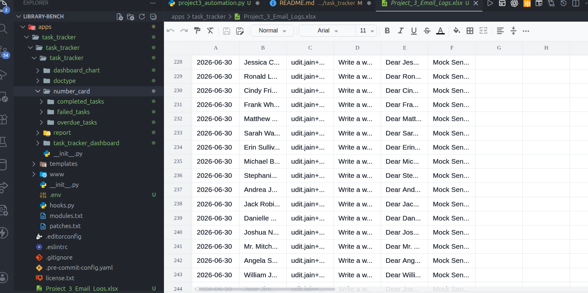

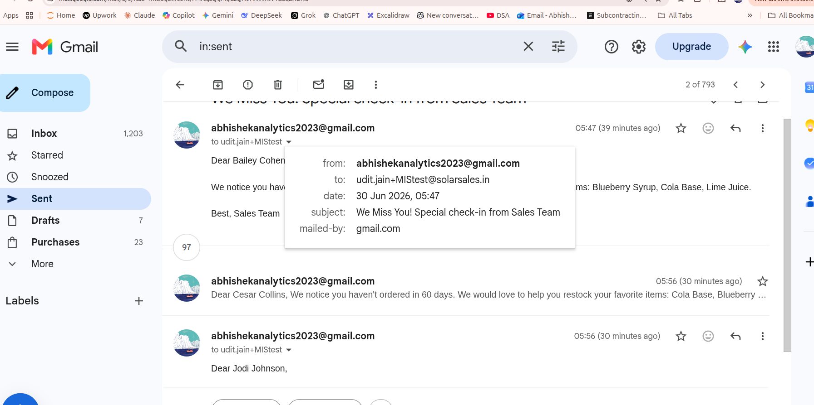